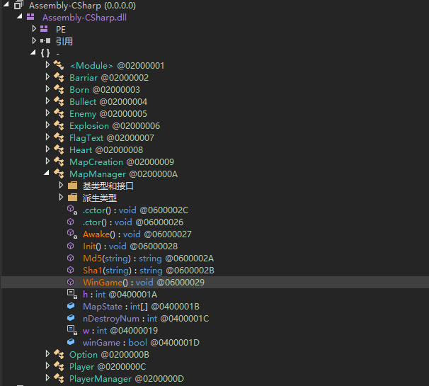
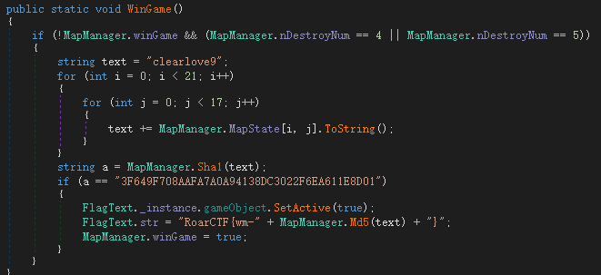
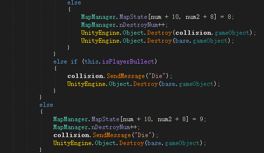
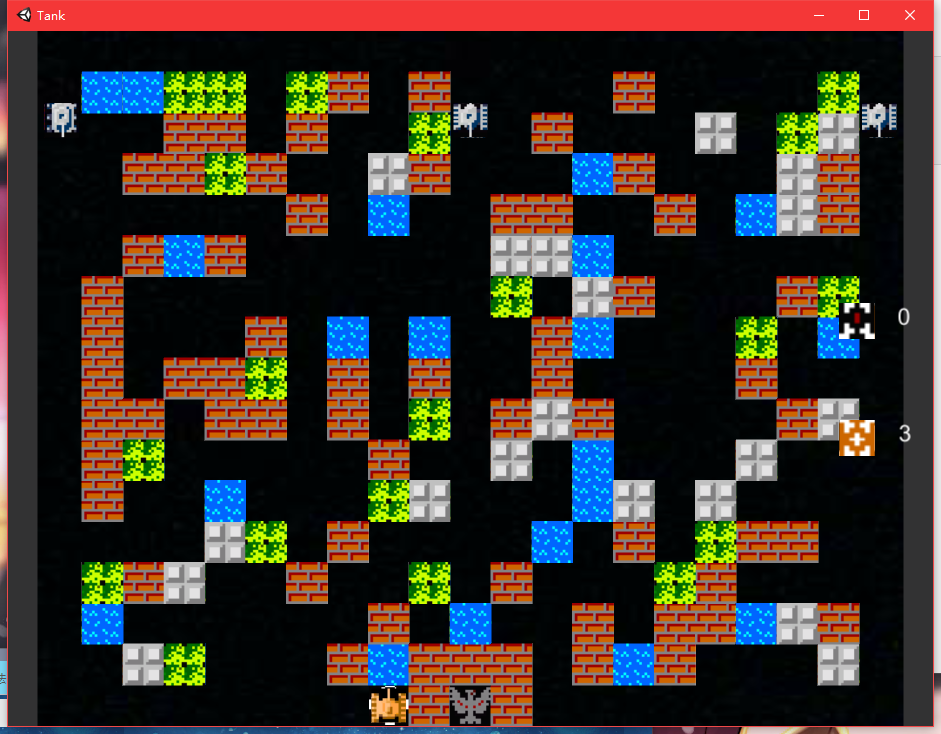

RoarCTF2019-TankGame WriteUp
=
在CSDN上也看到一篇这个的writeup粗略的看了下，看到了flag是对的，这就是我要的结果了，其他的不敢苟同。这个题是我的一个同学给我的，在我另一个朋友的帮助下，
成功的解出了该题，说一下解题思路。


1.准备工作
-
打开文件夹，发现是unity游戏打开游戏是坦克大战，结合上述条件，dnspy是跑不掉了。<br>
用dnspy打开Tank_Data\\Managed目录下的Assembly-CSharp.dll文件(dll本身也是可执行文件的一种)，就可以看到这个游戏全部的逻辑代码了。
<br>


2.逆向分析
-
经过查看每个类发现在MapManger下有个WinGame函数应该就是验证函数。

```
简要分析：
当没赢游戏，且nDestroyNum的数为4或者5的时候进行校验，如果满足SHA1(clearlove9+遍历(MapState))==
"3F649F708AAFA7A0A94138DC3022F6EA611E8D01"
即为通过，然后MD5(clearlove9+遍历(MapState))则是flag的一部分。
```
现在关键是找到是哪个地方修改了nDestroyNum，打开dnspy的搜索功能可以找到在Bullect类下面有个OnTriggerEnter2D函数
<br>

```
简要分析：
当打的是墙的时候就把MapState数组相应部分修改成8，如果是心脏就改成9
该说明的为什么+10 +8是因为坐标以屏幕中心有原点所以存在负座标
而数组以0开始
```
打开MapManger下的init函数 C#的看数组方式有点反人类这里我调成VB


与游戏界面对照不难发现，8是空白，1是普通可摧毁的墙，0是心脏。
也就是说摧毁相应的东西摧毁对了就给flag。

3.算法设计
-
有四种情况
```
1.摧毁4座墙(把4个1改成8)
2.摧毁5座墙(把5个1改成8)
3.摧毁3座墙加个心脏(把3个1改成8，0改成9)
4.摧毁4座墙加个心脏(把4个1改成8，0改成9)
```
经统计有65个墙，这典型的就是65选3，4，5 我首先想到了就是dfs算法，但是我是菜鸡想到了也不会实现。<br>
然后给朋友说了要求很快就给出算法(dalao就是不一样)

4.代码实现
-
实现用的是Java
Sha1Demo_2.java文件中给出了实现。
最后算出来的结果是
```
MapState[2,3]=8;
MapState[5,9]=8;
MapState[13,7]=8;
MapState[10,0]=9;
还得自杀，有点毒....
```
值的注意的是MD5取的是前10位大写
所以flag是
```
RoarCTF{wm-805CEC3545}
```
